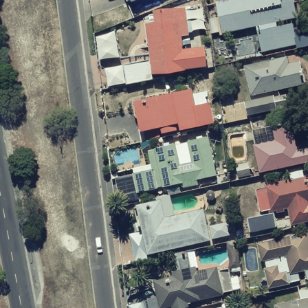
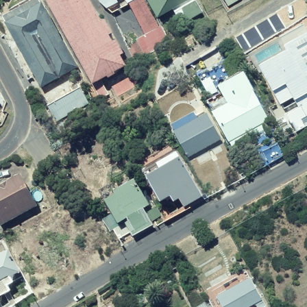
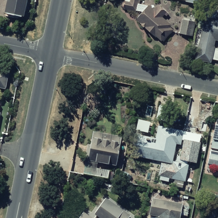
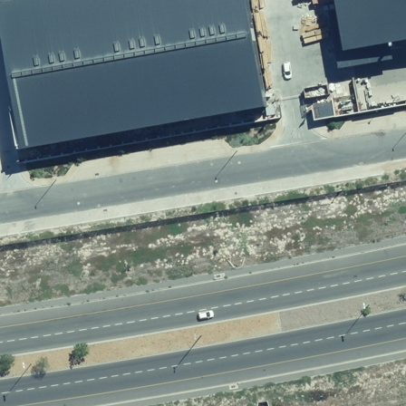

# Computer Vision classification challenge

## Task description

Use a sample of images from the swimming-pool dataset to develop a model that classifies whether
an image contains a swimming pool or not. Use the provided labels to validate your model.

## Solution overview

This script fine-tunes a 39M parameter [`CAFormer`](https://arxiv.org/abs/2210.13452) image
classification model on the swimming-pool dataset. The dataset consists of aerial images from
Cape Town, and is labelled for the presence of swimming pools or not

A series of experiments were conducted to find the best model architecture, training strategy, and hyperparameters.
Detailed results and analysis of these experiments can be found in the `./notebooks` directory in the repository.

A notebook version of this script is also available as a Jupyter notebook.
Please see `./notebooks/classification_model_experiment_04.ipynb`.

We will evaluate the following metrics on the validation set:

- [Balanced accuracy score](https://scikit-learn.org/stable/modules/generated/sklearn.metrics.balanced_accuracy_score.html)
- [Average Precision (AP)](https://scikit-learn.org/stable/modules/generated/sklearn.metrics.average_precision_score.html)
- [Precision](https://scikit-learn.org/stable/modules/generated/sklearn.metrics.precision_score.html)
- [Recall](https://scikit-learn.org/stable/modules/generated/sklearn.metrics.recall_score.html)
- [Area Under the Receiver Operating Characteristic Curve (ROC AUC)](https://scikit-learn.org/stable/modules/generated/sklearn.metrics.recall_score.html)

## Package versions
We keep track of the package versions used for reproducibility. The following key packages were used:

- torch==2.8.0
- torchvision==0.23.0
- fastai==2.8.4
- timm==1.0.20

## Data overview
Number of image files: 7043

### Class distribution
|   label |   count |
|--------:|--------:|
|       1 |    4643 |
|       0 |    2400 |

### Training and validation sets
We will use a random 20% of the data as the validation set. That means that 20% of the images will be held out from training and used to evaluate model performance after training.
While there is class imbalance in the dataset, given that we only have two classes and we have a relatively large sample of images, doing a simple random split should result in similarly balanced training and validation splits.

Training/validation split summary:

- Training set size:   5635
- Validation set size: 1408

Percentage positive class:

- Training:   66.1%
- Validation: 65.4%

### Sample images

#### Sample image 1 - with swimming pool
Image path: ../ds_code_challenge_data/images/swimming-pool/yes/W35A_7_58.tif



#### Sample image 2 - with swimming pool
Image path: ../ds_code_challenge_data/images/swimming-pool/yes/W18B_8_68.tif



#### Sample image 3 - without swimming pool
Image path: ../ds_code_challenge_data/images/swimming-pool/no/W17B_13_12.tif



#### Sample image 4 - without swimming pool
Image path: ../ds_code_challenge_data/images/swimming-pool/no/W25A_16_45.tif



## Data transformations and augmentations
Image transformations are required to resize the images to the input size expected by the model backbone or to reduce the memory footprint during training. Images must also be normalised using the same mean and standard deviation as used during pretraining of the model backbone. We will also apply some data augmentations to the training images to reduce overfitting and improve model generalisation by exposing the model to more diverse training data.

The following transformations and augmentations will be applied to the training images:

- Resize
    - area_for_downscale: None
    - height: 384
    - interpolation: 1
    - mask_interpolation: 0
    - p: 1.0
    - width: 384
- HorizontalFlip
    - p: 0.5
- RandomBrightnessContrast
    - brightness_by_max: True
    - brightness_limit: (-0.2, 0.2)
    - contrast_limit: (-0.2, 0.2)
    - ensure_safe_range: False
    - p: 0.2
- Normalize
    - max_pixel_value: 255.0
    - mean: (0.485, 0.456, 0.406)
    - normalization: standard
    - p: 1.0
    - std: (0.229, 0.224, 0.225)

## Model setup
We will use a pretrained model from the `timm` library as the backbone of our classifier. The final classification head will be randomly initialised. For detailed information about the model architecture, see the Appendix.

- Model backbone: `caformer_s36.sail_in22k_ft_in1k_384`

## Model training

- Freeze all model parameters except for the classification head and train the head for 1 epochs.
- Unfreeze all model parameters and fine-tune the entire model for 5 epochs.

### Training log for fine-tuning the classifier head

|   epoch |   train_loss |   valid_loss |   balanced_accuracy_score |   average_precision_score |   precision_score |   recall_score |   roc_auc_score |
|--------:|-------------:|-------------:|--------------------------:|--------------------------:|------------------:|---------------:|----------------:|
|       0 |     0.226964 |     0.219799 |                  0.901068 |                  0.982425 |          0.940583 |       0.910966 |        0.967554 |

### Training log for full model fine-tuning

|   epoch |   train_loss |   valid_loss |   balanced_accuracy_score |   average_precision_score |   precision_score |   recall_score |   roc_auc_score |
|--------:|-------------:|-------------:|--------------------------:|--------------------------:|------------------:|---------------:|----------------:|
|       0 |     0.190582 |     0.223514 |                  0.897789 |                  0.983291 |          0.924307 |       0.941368 |        0.969273 |
|       1 |     0.178578 |     0.206356 |                  0.898708 |                  0.984618 |          0.934807 |       0.918567 |        0.97152  |
|       2 |     0.170165 |     0.200682 |                  0.900289 |                  0.985581 |          0.944255 |       0.901194 |        0.973145 |
|       3 |     0.175896 |     0.20096  |                  0.90488  |                  0.986006 |          0.949599 |       0.900109 |        0.973801 |
|       4 |     0.178888 |     0.200853 |                  0.903853 |                  0.986053 |          0.948513 |       0.900109 |        0.973879 |

## Appendix: Detailed model summary

```
MetaFormer (Input shape: 16 x 3 x 384 x 384)
============================================================================
Layer (type)         Output Shape         Param #    Trainable 
============================================================================
                     16 x 64 x 96 x 96   
Conv2d                                    9472       True      
LayerNorm2dNoBias                         64         True      
Identity                                                       
LayerNorm2dNoBias                         64         True      
____________________________________________________________________________
                     16 x 128 x 96 x 96  
Conv2d                                    8192       True      
ReLU                                                           
Conv2d                                    6272       True      
Identity                                                       
____________________________________________________________________________
                     16 x 64 x 96 x 96   
Conv2d                                    8192       True      
Identity                                                       
Identity                                                       
Identity                                                       
LayerNorm2dNoBias                         64         True      
____________________________________________________________________________
                     16 x 256 x 96 x 96  
Conv2d                                    16384      True      
ReLU                                                           
Dropout                                                        
Identity                                                       
____________________________________________________________________________
                     16 x 64 x 96 x 96   
Conv2d                                    16384      True      
Dropout                                                        
Identity                                                       
Identity                                                       
Identity                                                       
LayerNorm2dNoBias                         64         True      
____________________________________________________________________________
                     16 x 128 x 96 x 96  
Conv2d                                    8192       True      
ReLU                                                           
Conv2d                                    6272       True      
Identity                                                       
____________________________________________________________________________
                     16 x 64 x 96 x 96   
Conv2d                                    8192       True      
Identity                                                       
Identity                                                       
Identity                                                       
LayerNorm2dNoBias                         64         True      
____________________________________________________________________________
                     16 x 256 x 96 x 96  
Conv2d                                    16384      True      
ReLU                                                           
Dropout                                                        
Identity                                                       
____________________________________________________________________________
                     16 x 64 x 96 x 96   
Conv2d                                    16384      True      
Dropout                                                        
Identity                                                       
Identity                                                       
Identity                                                       
LayerNorm2dNoBias                         64         True      
____________________________________________________________________________
                     16 x 128 x 96 x 96  
Conv2d                                    8192       True      
ReLU                                                           
Conv2d                                    6272       True      
Identity                                                       
____________________________________________________________________________
                     16 x 64 x 96 x 96   
Conv2d                                    8192       True      
Identity                                                       
Identity                                                       
Identity                                                       
LayerNorm2dNoBias                         64         True      
____________________________________________________________________________
                     16 x 256 x 96 x 96  
Conv2d                                    16384      True      
ReLU                                                           
Dropout                                                        
Identity                                                       
____________________________________________________________________________
                     16 x 64 x 96 x 96   
Conv2d                                    16384      True      
Dropout                                                        
Identity                                                       
Identity                                                       
Identity                                                       
LayerNorm2dNoBias                         64         True      
____________________________________________________________________________
                     16 x 128 x 48 x 48  
Conv2d                                    73856      True      
LayerNorm2dNoBias                         128        True      
____________________________________________________________________________
                     16 x 256 x 48 x 48  
Conv2d                                    32768      True      
ReLU                                                           
Conv2d                                    12544      True      
Identity                                                       
____________________________________________________________________________
                     16 x 128 x 48 x 48  
Conv2d                                    32768      True      
Identity                                                       
Identity                                                       
Identity                                                       
LayerNorm2dNoBias                         128        True      
____________________________________________________________________________
                     16 x 512 x 48 x 48  
Conv2d                                    65536      True      
ReLU                                                           
Dropout                                                        
Identity                                                       
____________________________________________________________________________
                     16 x 128 x 48 x 48  
Conv2d                                    65536      True      
Dropout                                                        
Identity                                                       
Identity                                                       
Identity                                                       
LayerNorm2dNoBias                         128        True      
____________________________________________________________________________
                     16 x 256 x 48 x 48  
Conv2d                                    32768      True      
ReLU                                                           
Conv2d                                    12544      True      
Identity                                                       
____________________________________________________________________________
                     16 x 128 x 48 x 48  
Conv2d                                    32768      True      
Identity                                                       
Identity                                                       
Identity                                                       
LayerNorm2dNoBias                         128        True      
____________________________________________________________________________
                     16 x 512 x 48 x 48  
Conv2d                                    65536      True      
ReLU                                                           
Dropout                                                        
Identity                                                       
____________________________________________________________________________
                     16 x 128 x 48 x 48  
Conv2d                                    65536      True      
Dropout                                                        
Identity                                                       
Identity                                                       
Identity                                                       
LayerNorm2dNoBias                         128        True      
____________________________________________________________________________
                     16 x 256 x 48 x 48  
Conv2d                                    32768      True      
ReLU                                                           
Conv2d                                    12544      True      
Identity                                                       
____________________________________________________________________________
                     16 x 128 x 48 x 48  
Conv2d                                    32768      True      
Identity                                                       
Identity                                                       
Identity                                                       
LayerNorm2dNoBias                         128        True      
____________________________________________________________________________
                     16 x 512 x 48 x 48  
Conv2d                                    65536      True      
ReLU                                                           
Dropout                                                        
Identity                                                       
____________________________________________________________________________
                     16 x 128 x 48 x 48  
Conv2d                                    65536      True      
Dropout                                                        
Identity                                                       
Identity                                                       
Identity                                                       
LayerNorm2dNoBias                         128        True      
____________________________________________________________________________
                     16 x 256 x 48 x 48  
Conv2d                                    32768      True      
ReLU                                                           
Conv2d                                    12544      True      
Identity                                                       
____________________________________________________________________________
                     16 x 128 x 48 x 48  
Conv2d                                    32768      True      
Identity                                                       
Identity                                                       
Identity                                                       
LayerNorm2dNoBias                         128        True      
____________________________________________________________________________
                     16 x 512 x 48 x 48  
Conv2d                                    65536      True      
ReLU                                                           
Dropout                                                        
Identity                                                       
____________________________________________________________________________
                     16 x 128 x 48 x 48  
Conv2d                                    65536      True      
Dropout                                                        
Identity                                                       
Identity                                                       
Identity                                                       
LayerNorm2dNoBias                         128        True      
____________________________________________________________________________
                     16 x 256 x 48 x 48  
Conv2d                                    32768      True      
ReLU                                                           
Conv2d                                    12544      True      
Identity                                                       
____________________________________________________________________________
                     16 x 128 x 48 x 48  
Conv2d                                    32768      True      
Identity                                                       
Identity                                                       
Identity                                                       
LayerNorm2dNoBias                         128        True      
____________________________________________________________________________
                     16 x 512 x 48 x 48  
Conv2d                                    65536      True      
ReLU                                                           
Dropout                                                        
Identity                                                       
____________________________________________________________________________
                     16 x 128 x 48 x 48  
Conv2d                                    65536      True      
Dropout                                                        
Identity                                                       
Identity                                                       
Identity                                                       
LayerNorm2dNoBias                         128        True      
____________________________________________________________________________
                     16 x 256 x 48 x 48  
Conv2d                                    32768      True      
ReLU                                                           
Conv2d                                    12544      True      
Identity                                                       
____________________________________________________________________________
                     16 x 128 x 48 x 48  
Conv2d                                    32768      True      
Identity                                                       
Identity                                                       
Identity                                                       
LayerNorm2dNoBias                         128        True      
____________________________________________________________________________
                     16 x 512 x 48 x 48  
Conv2d                                    65536      True      
ReLU                                                           
Dropout                                                        
Identity                                                       
____________________________________________________________________________
                     16 x 128 x 48 x 48  
Conv2d                                    65536      True      
Dropout                                                        
Identity                                                       
Identity                                                       
Identity                                                       
LayerNorm2dNoBias                         128        True      
____________________________________________________________________________
                     16 x 256 x 48 x 48  
Conv2d                                    32768      True      
ReLU                                                           
Conv2d                                    12544      True      
Identity                                                       
____________________________________________________________________________
                     16 x 128 x 48 x 48  
Conv2d                                    32768      True      
Identity                                                       
Identity                                                       
Identity                                                       
LayerNorm2dNoBias                         128        True      
____________________________________________________________________________
                     16 x 512 x 48 x 48  
Conv2d                                    65536      True      
ReLU                                                           
Dropout                                                        
Identity                                                       
____________________________________________________________________________
                     16 x 128 x 48 x 48  
Conv2d                                    65536      True      
Dropout                                                        
Identity                                                       
Identity                                                       
Identity                                                       
LayerNorm2dNoBias                         128        True      
____________________________________________________________________________
                     16 x 256 x 48 x 48  
Conv2d                                    32768      True      
ReLU                                                           
Conv2d                                    12544      True      
Identity                                                       
____________________________________________________________________________
                     16 x 128 x 48 x 48  
Conv2d                                    32768      True      
Identity                                                       
Identity                                                       
Identity                                                       
LayerNorm2dNoBias                         128        True      
____________________________________________________________________________
                     16 x 512 x 48 x 48  
Conv2d                                    65536      True      
ReLU                                                           
Dropout                                                        
Identity                                                       
____________________________________________________________________________
                     16 x 128 x 48 x 48  
Conv2d                                    65536      True      
Dropout                                                        
Identity                                                       
Identity                                                       
Identity                                                       
LayerNorm2dNoBias                         128        True      
____________________________________________________________________________
                     16 x 256 x 48 x 48  
Conv2d                                    32768      True      
ReLU                                                           
Conv2d                                    12544      True      
Identity                                                       
____________________________________________________________________________
                     16 x 128 x 48 x 48  
Conv2d                                    32768      True      
Identity                                                       
Identity                                                       
Identity                                                       
LayerNorm2dNoBias                         128        True      
____________________________________________________________________________
                     16 x 512 x 48 x 48  
Conv2d                                    65536      True      
ReLU                                                           
Dropout                                                        
Identity                                                       
____________________________________________________________________________
                     16 x 128 x 48 x 48  
Conv2d                                    65536      True      
Dropout                                                        
Identity                                                       
Identity                                                       
Identity                                                       
LayerNorm2dNoBias                         128        True      
____________________________________________________________________________
                     16 x 256 x 48 x 48  
Conv2d                                    32768      True      
ReLU                                                           
Conv2d                                    12544      True      
Identity                                                       
____________________________________________________________________________
                     16 x 128 x 48 x 48  
Conv2d                                    32768      True      
Identity                                                       
Identity                                                       
Identity                                                       
LayerNorm2dNoBias                         128        True      
____________________________________________________________________________
                     16 x 512 x 48 x 48  
Conv2d                                    65536      True      
ReLU                                                           
Dropout                                                        
Identity                                                       
____________________________________________________________________________
                     16 x 128 x 48 x 48  
Conv2d                                    65536      True      
Dropout                                                        
Identity                                                       
Identity                                                       
Identity                                                       
LayerNorm2dNoBias                         128        True      
____________________________________________________________________________
                     16 x 256 x 48 x 48  
Conv2d                                    32768      True      
ReLU                                                           
Conv2d                                    12544      True      
Identity                                                       
____________________________________________________________________________
                     16 x 128 x 48 x 48  
Conv2d                                    32768      True      
Identity                                                       
Identity                                                       
Identity                                                       
LayerNorm2dNoBias                         128        True      
____________________________________________________________________________
                     16 x 512 x 48 x 48  
Conv2d                                    65536      True      
ReLU                                                           
Dropout                                                        
Identity                                                       
____________________________________________________________________________
                     16 x 128 x 48 x 48  
Conv2d                                    65536      True      
Dropout                                                        
Identity                                                       
Identity                                                       
Identity                                                       
LayerNorm2dNoBias                         128        True      
____________________________________________________________________________
                     16 x 256 x 48 x 48  
Conv2d                                    32768      True      
ReLU                                                           
Conv2d                                    12544      True      
Identity                                                       
____________________________________________________________________________
                     16 x 128 x 48 x 48  
Conv2d                                    32768      True      
Identity                                                       
Identity                                                       
Identity                                                       
LayerNorm2dNoBias                         128        True      
____________________________________________________________________________
                     16 x 512 x 48 x 48  
Conv2d                                    65536      True      
ReLU                                                           
Dropout                                                        
Identity                                                       
____________________________________________________________________________
                     16 x 128 x 48 x 48  
Conv2d                                    65536      True      
Dropout                                                        
Identity                                                       
Identity                                                       
Identity                                                       
LayerNorm2dNoBias                         128        True      
____________________________________________________________________________
                     16 x 320 x 24 x 24  
Conv2d                                    368960     True      
LayerNormNoBias                           320        True      
____________________________________________________________________________
                     16 x 576 x 960      
Linear                                    307200     True      
Linear                                    102400     True      
Dropout                                                        
Identity                                                       
Identity                                                       
Scale                                                          
LayerNormNoBias                           320        True      
____________________________________________________________________________
                     16 x 576 x 1280     
Linear                                    409600     True      
ReLU                                                           
Dropout                                                        
Identity                                                       
____________________________________________________________________________
                     16 x 576 x 320      
Linear                                    409600     True      
Dropout                                                        
Identity                                                       
Identity                                                       
Scale                                                          
LayerNormNoBias                           320        True      
____________________________________________________________________________
                     16 x 576 x 960      
Linear                                    307200     True      
Linear                                    102400     True      
Dropout                                                        
Identity                                                       
Identity                                                       
Scale                                                          
LayerNormNoBias                           320        True      
____________________________________________________________________________
                     16 x 576 x 1280     
Linear                                    409600     True      
ReLU                                                           
Dropout                                                        
Identity                                                       
____________________________________________________________________________
                     16 x 576 x 320      
Linear                                    409600     True      
Dropout                                                        
Identity                                                       
Identity                                                       
Scale                                                          
LayerNormNoBias                           320        True      
____________________________________________________________________________
                     16 x 576 x 960      
Linear                                    307200     True      
Linear                                    102400     True      
Dropout                                                        
Identity                                                       
Identity                                                       
Scale                                                          
LayerNormNoBias                           320        True      
____________________________________________________________________________
                     16 x 576 x 1280     
Linear                                    409600     True      
ReLU                                                           
Dropout                                                        
Identity                                                       
____________________________________________________________________________
                     16 x 576 x 320      
Linear                                    409600     True      
Dropout                                                        
Identity                                                       
Identity                                                       
Scale                                                          
LayerNormNoBias                           320        True      
____________________________________________________________________________
                     16 x 576 x 960      
Linear                                    307200     True      
Linear                                    102400     True      
Dropout                                                        
Identity                                                       
Identity                                                       
Scale                                                          
LayerNormNoBias                           320        True      
____________________________________________________________________________
                     16 x 576 x 1280     
Linear                                    409600     True      
ReLU                                                           
Dropout                                                        
Identity                                                       
____________________________________________________________________________
                     16 x 576 x 320      
Linear                                    409600     True      
Dropout                                                        
Identity                                                       
Identity                                                       
Scale                                                          
LayerNormNoBias                           320        True      
____________________________________________________________________________
                     16 x 576 x 960      
Linear                                    307200     True      
Linear                                    102400     True      
Dropout                                                        
Identity                                                       
Identity                                                       
Scale                                                          
LayerNormNoBias                           320        True      
____________________________________________________________________________
                     16 x 576 x 1280     
Linear                                    409600     True      
ReLU                                                           
Dropout                                                        
Identity                                                       
____________________________________________________________________________
                     16 x 576 x 320      
Linear                                    409600     True      
Dropout                                                        
Identity                                                       
Identity                                                       
Scale                                                          
LayerNormNoBias                           320        True      
____________________________________________________________________________
                     16 x 576 x 960      
Linear                                    307200     True      
Linear                                    102400     True      
Dropout                                                        
Identity                                                       
Identity                                                       
Scale                                                          
LayerNormNoBias                           320        True      
____________________________________________________________________________
                     16 x 576 x 1280     
Linear                                    409600     True      
ReLU                                                           
Dropout                                                        
Identity                                                       
____________________________________________________________________________
                     16 x 576 x 320      
Linear                                    409600     True      
Dropout                                                        
Identity                                                       
Identity                                                       
Scale                                                          
LayerNormNoBias                           320        True      
____________________________________________________________________________
                     16 x 576 x 960      
Linear                                    307200     True      
Linear                                    102400     True      
Dropout                                                        
Identity                                                       
Identity                                                       
Scale                                                          
LayerNormNoBias                           320        True      
____________________________________________________________________________
                     16 x 576 x 1280     
Linear                                    409600     True      
ReLU                                                           
Dropout                                                        
Identity                                                       
____________________________________________________________________________
                     16 x 576 x 320      
Linear                                    409600     True      
Dropout                                                        
Identity                                                       
Identity                                                       
Scale                                                          
LayerNormNoBias                           320        True      
____________________________________________________________________________
                     16 x 576 x 960      
Linear                                    307200     True      
Linear                                    102400     True      
Dropout                                                        
Identity                                                       
Identity                                                       
Scale                                                          
LayerNormNoBias                           320        True      
____________________________________________________________________________
                     16 x 576 x 1280     
Linear                                    409600     True      
ReLU                                                           
Dropout                                                        
Identity                                                       
____________________________________________________________________________
                     16 x 576 x 320      
Linear                                    409600     True      
Dropout                                                        
Identity                                                       
Identity                                                       
Scale                                                          
LayerNormNoBias                           320        True      
____________________________________________________________________________
                     16 x 576 x 960      
Linear                                    307200     True      
Linear                                    102400     True      
Dropout                                                        
Identity                                                       
Identity                                                       
Scale                                                          
LayerNormNoBias                           320        True      
____________________________________________________________________________
                     16 x 576 x 1280     
Linear                                    409600     True      
ReLU                                                           
Dropout                                                        
Identity                                                       
____________________________________________________________________________
                     16 x 576 x 320      
Linear                                    409600     True      
Dropout                                                        
Identity                                                       
Identity                                                       
Scale                                                          
LayerNormNoBias                           320        True      
____________________________________________________________________________
                     16 x 576 x 960      
Linear                                    307200     True      
Linear                                    102400     True      
Dropout                                                        
Identity                                                       
Identity                                                       
Scale                                                          
LayerNormNoBias                           320        True      
____________________________________________________________________________
                     16 x 576 x 1280     
Linear                                    409600     True      
ReLU                                                           
Dropout                                                        
Identity                                                       
____________________________________________________________________________
                     16 x 576 x 320      
Linear                                    409600     True      
Dropout                                                        
Identity                                                       
Identity                                                       
Scale                                                          
LayerNormNoBias                           320        True      
____________________________________________________________________________
                     16 x 576 x 960      
Linear                                    307200     True      
Linear                                    102400     True      
Dropout                                                        
Identity                                                       
Identity                                                       
Scale                                                          
LayerNormNoBias                           320        True      
____________________________________________________________________________
                     16 x 576 x 1280     
Linear                                    409600     True      
ReLU                                                           
Dropout                                                        
Identity                                                       
____________________________________________________________________________
                     16 x 576 x 320      
Linear                                    409600     True      
Dropout                                                        
Identity                                                       
Identity                                                       
Scale                                                          
LayerNormNoBias                           320        True      
____________________________________________________________________________
                     16 x 576 x 960      
Linear                                    307200     True      
Linear                                    102400     True      
Dropout                                                        
Identity                                                       
Identity                                                       
Scale                                                          
LayerNormNoBias                           320        True      
____________________________________________________________________________
                     16 x 576 x 1280     
Linear                                    409600     True      
ReLU                                                           
Dropout                                                        
Identity                                                       
____________________________________________________________________________
                     16 x 576 x 320      
Linear                                    409600     True      
Dropout                                                        
Identity                                                       
Identity                                                       
Scale                                                          
LayerNormNoBias                           320        True      
____________________________________________________________________________
                     16 x 576 x 960      
Linear                                    307200     True      
Linear                                    102400     True      
Dropout                                                        
Identity                                                       
Identity                                                       
Scale                                                          
LayerNormNoBias                           320        True      
____________________________________________________________________________
                     16 x 576 x 1280     
Linear                                    409600     True      
ReLU                                                           
Dropout                                                        
Identity                                                       
____________________________________________________________________________
                     16 x 576 x 320      
Linear                                    409600     True      
Dropout                                                        
Identity                                                       
Identity                                                       
Scale                                                          
LayerNormNoBias                           320        True      
____________________________________________________________________________
                     16 x 576 x 960      
Linear                                    307200     True      
Linear                                    102400     True      
Dropout                                                        
Identity                                                       
Identity                                                       
Scale                                                          
LayerNormNoBias                           320        True      
____________________________________________________________________________
                     16 x 576 x 1280     
Linear                                    409600     True      
ReLU                                                           
Dropout                                                        
Identity                                                       
____________________________________________________________________________
                     16 x 576 x 320      
Linear                                    409600     True      
Dropout                                                        
Identity                                                       
Identity                                                       
Scale                                                          
LayerNormNoBias                           320        True      
____________________________________________________________________________
                     16 x 576 x 960      
Linear                                    307200     True      
Linear                                    102400     True      
Dropout                                                        
Identity                                                       
Identity                                                       
Scale                                                          
LayerNormNoBias                           320        True      
____________________________________________________________________________
                     16 x 576 x 1280     
Linear                                    409600     True      
ReLU                                                           
Dropout                                                        
Identity                                                       
____________________________________________________________________________
                     16 x 576 x 320      
Linear                                    409600     True      
Dropout                                                        
Identity                                                       
Identity                                                       
Scale                                                          
LayerNormNoBias                           320        True      
____________________________________________________________________________
                     16 x 576 x 960      
Linear                                    307200     True      
Linear                                    102400     True      
Dropout                                                        
Identity                                                       
Identity                                                       
Scale                                                          
LayerNormNoBias                           320        True      
____________________________________________________________________________
                     16 x 576 x 1280     
Linear                                    409600     True      
ReLU                                                           
Dropout                                                        
Identity                                                       
____________________________________________________________________________
                     16 x 576 x 320      
Linear                                    409600     True      
Dropout                                                        
Identity                                                       
Identity                                                       
Scale                                                          
LayerNormNoBias                           320        True      
____________________________________________________________________________
                     16 x 576 x 960      
Linear                                    307200     True      
Linear                                    102400     True      
Dropout                                                        
Identity                                                       
Identity                                                       
Scale                                                          
LayerNormNoBias                           320        True      
____________________________________________________________________________
                     16 x 576 x 1280     
Linear                                    409600     True      
ReLU                                                           
Dropout                                                        
Identity                                                       
____________________________________________________________________________
                     16 x 576 x 320      
Linear                                    409600     True      
Dropout                                                        
Identity                                                       
Identity                                                       
Scale                                                          
LayerNormNoBias                           320        True      
____________________________________________________________________________
                     16 x 576 x 960      
Linear                                    307200     True      
Linear                                    102400     True      
Dropout                                                        
Identity                                                       
Identity                                                       
Scale                                                          
LayerNormNoBias                           320        True      
____________________________________________________________________________
                     16 x 576 x 1280     
Linear                                    409600     True      
ReLU                                                           
Dropout                                                        
Identity                                                       
____________________________________________________________________________
                     16 x 576 x 320      
Linear                                    409600     True      
Dropout                                                        
Identity                                                       
Identity                                                       
Scale                                                          
LayerNorm2dNoBias                         320        True      
____________________________________________________________________________
                     16 x 512 x 12 x 12  
Conv2d                                    1475072    True      
LayerNormNoBias                           512        True      
____________________________________________________________________________
                     16 x 144 x 1536     
Linear                                    786432     True      
Linear                                    262144     True      
Dropout                                                        
Identity                                                       
Identity                                                       
Scale                                                          
LayerNormNoBias                           512        True      
____________________________________________________________________________
                     16 x 144 x 2048     
Linear                                    1048576    True      
ReLU                                                           
Dropout                                                        
Identity                                                       
____________________________________________________________________________
                     16 x 144 x 512      
Linear                                    1048576    True      
Dropout                                                        
Identity                                                       
Identity                                                       
Scale                                                          
LayerNormNoBias                           512        True      
____________________________________________________________________________
                     16 x 144 x 1536     
Linear                                    786432     True      
Linear                                    262144     True      
Dropout                                                        
Identity                                                       
Identity                                                       
Scale                                                          
LayerNormNoBias                           512        True      
____________________________________________________________________________
                     16 x 144 x 2048     
Linear                                    1048576    True      
ReLU                                                           
Dropout                                                        
Identity                                                       
____________________________________________________________________________
                     16 x 144 x 512      
Linear                                    1048576    True      
Dropout                                                        
Identity                                                       
Identity                                                       
Scale                                                          
LayerNormNoBias                           512        True      
____________________________________________________________________________
                     16 x 144 x 1536     
Linear                                    786432     True      
Linear                                    262144     True      
Dropout                                                        
Identity                                                       
Identity                                                       
Scale                                                          
LayerNormNoBias                           512        True      
____________________________________________________________________________
                     16 x 144 x 2048     
Linear                                    1048576    True      
ReLU                                                           
Dropout                                                        
Identity                                                       
____________________________________________________________________________
                     16 x 144 x 512      
Linear                                    1048576    True      
Dropout                                                        
Identity                                                       
Identity                                                       
Scale                                                          
____________________________________________________________________________
                     16 x 512 x 1 x 1    
AdaptiveAvgPool2d                                              
Identity                                                       
LayerNorm2d                               1024       True      
____________________________________________________________________________
                     16 x 512            
Flatten                                                        
Dropout                                                        
____________________________________________________________________________
                     16 x 2048           
Linear                                    1050624    True      
ReLU                                                           
LayerNorm                                 4096       True      
____________________________________________________________________________
                     16 x 1              
Linear                                    2049       True      
Dropout                                                        
____________________________________________________________________________

Total params: 37,235,457
Total trainable params: 37,235,457
Total non-trainable params: 0

Optimizer used: <function Adam at 0x7fe3dd117060>
Loss function: FlattenedLoss of BCEWithLogitsLoss()

Callbacks:
  - TrainEvalCallback
  - CastToTensor
  - Recorder
  - ProgressCallback
  - CSVLogger
```